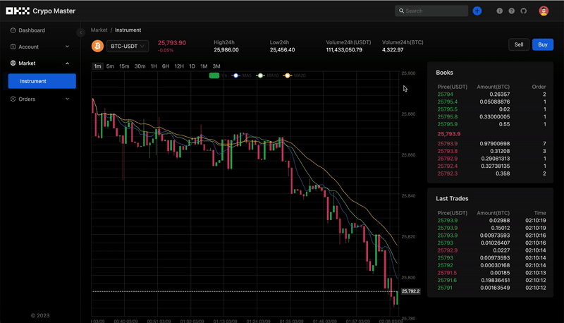
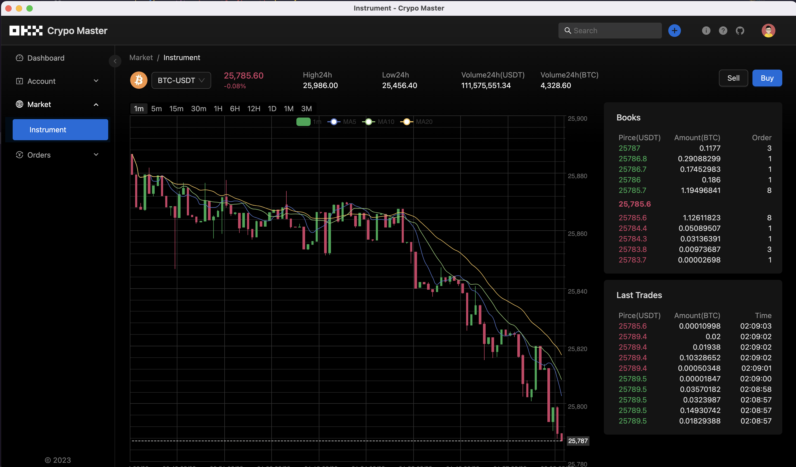

# okx-node

[![npm package][npm-img]][npm-url]
[![Downloads][downloads-img]][downloads-url]
[![Lint Status][lint-img]][lint-url]
[![Test Status][test-img]][test-url]
[![Build Status][build-img]][build-url]
[![Release Status][release-img]][release-url]
[![Issues][issues-img]][issues-url]
[![Code Coverage][codecov-img]][codecov-url]

> My awesome module

## Install

```bash
npm install okx-node
```

## Usage

```ts
import { OkxRestClient, OkxWebSocketClient } from 'okx-node';

const okxRestClient = new OkxRestClient(
  {
    apiKey: API_KEY,
    apiPass: PASSPHRASE,
    apiSecret: SECRET_KEY,
  },
  MARKET
);

const okxWsClient = OkxWebSocketClient.getInstance({
  apiKey: API_KEY,
  passphrase: PASSPHRASE,
  secretKey: SECRET_KEY,
  market: MARKET,
});

void okxRestClient.getPositions().then(data => console.log(data));
void okxRestClient
  .getIndexTickers({ instId: 'BTC-USDT' })
  .then(data => console.log(data));

const channel = 'index-candle15m';
const eventName = `push-${channel}` as const;
const args: WsPublicChannelArgInstId[] = [
  {
    channel,
    instId: 'BTC-USDT',
  },
];
okxWsClient.subscribe({
  op: 'subscribe',
  args,
});
okxWsClient.on(eventName, data => console.log(data));
```

## Browser Usage

Need to install `events` package.

```base
npm install events -s
```

## Use Case

- okx-app [Crypto Master](./packages/okx-app/README.md)
  
  

<!--badge-variables-->

[lint-img]: https://github.com/hsuehic/okx-node/actions/workflows/lint.yml/badge.svg
[lint-url]: https://github.com/hsuehic/okx-node/workflows/lint.yml
[test-img]: https://github.com/hsuehic/okx-node/actions/workflows/test.yml/badge.svg
[test-url]: https://github.com/hsuehic/okx-node/workflows/test.yml
[build-img]: https://github.com/hsuehic/okx-node/actions/workflows/build.yml/badge.svg
[build-url]: https://github.com/hsuehic/okx-node/workflows/build.yml
[release-img]: https://github.com/hsuehic/okx-node/actions/workflows/release.yml/badge.svg
[release-url]: https://github.com/hsuehic/okx-node/workflows/release.yml
[downloads-img]: https://img.shields.io/npm/dt/okx-node
[downloads-url]: https://www.npmtrends.com/okx-node
[npm-img]: https://img.shields.io/npm/v/okx-node
[npm-url]: https://www.npmjs.com/package/okx-node
[issues-img]: https://img.shields.io/github/issues/hsuehic/okx-node
[issues-url]: https://github.com/hsuehic/okx-node/issues
[codecov-img]: https://codecov.io/gh/hsuehic/okx-node/branch/main/graph/badge.svg
[codecov-url]: https://codecov.io/gh/hsuehic/okx-node

<!--badge-variables-->

## References

- https://pnpm.io/docker

## Memo

- `docker-compose run` ignores `ports` unless you include `--service-ports`.
- Port mapping is incompatible with `network_mode: host`
